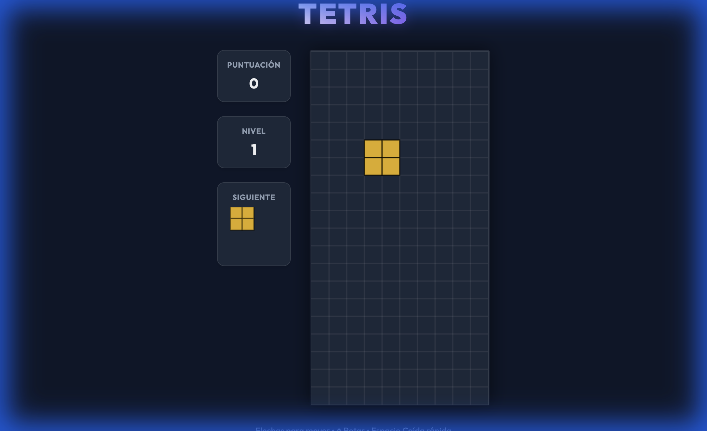

# Tetris JS 🎮

A modern, vanilla JavaScript implementation of the classic Tetris game. Built with HTML5 Canvas and CSS3, featuring a premium neon aesthetic and no external dependencies.



## ✨ Features

- **Vanilla JavaScript**: No frameworks, no build tools, just pure web standards.
- **Cross-Platform**: Runs in any modern web browser (Desktop & Mobile).
- **Responsive Design**: Adapts to different screen sizes.
- **Premium UI**: Dark mode with neon accents and smooth visibility.
- **Internationalization (i18n)**: Automatically detects and switches between English and Spanish.
- **Local Execution**: Optimized to run directly from your file system (no local server needed).

## 🚀 How to Run

1.  Clone the repository:
    ```bash
    git clone https://github.com/yourusername/tetris-js.git
    ```
2.  Open `index.html` in your favorite web browser.
3.  Enjoy!

## 🕹️ Controls

| Key | Action |
| --- | --- |
| **⬅️ Left Arrow** | Move Left |
| **➡️ Right Arrow** | Move Right |
| **⬆️ Up Arrow** | Rotate Piece |
| **⬇️ Down Arrow** | Soft Drop (Accelerate) |
| **Space** | Hard Drop (Instant Lock) |

## 🛠️ Tech Stack

- **HTML5 Canvas** for rendering the game board.
- **CSS3** for layout, styling, and animations.
- **JavaScript (ES6+)** for game logic.

## 📄 License

This project is licensed under the MIT License - see the [LICENSE](LICENSE) file for details.
